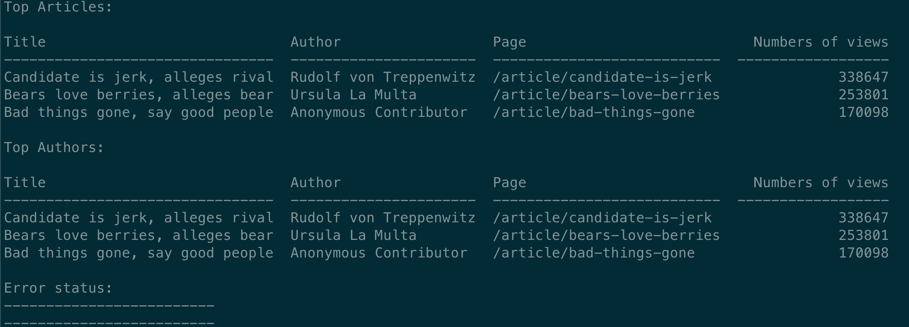

#### Udacity Full-Stack Nanodegree


### logs analysys

An internal reporting tool that uses information of large database of a web server and draw business conclusions from that information. (Project from Full Stack Web Development Nanodegree)

### Introduction


A python module that uses information of large database of a web server and draw conclusions from that information. The database contains newspaper articles and authors, as well as the web server log for the site. The log has a database row for each time a reader loaded a web page. The database includes three tables:

The authors table includes information about the authors of articles.
The articles table includes the articles themselves.
The log table includes one entry for each time a user has accessed the site.


The project prints following data:
Most popular three articles of all time.
Most popular article authors of all time.


### Technologies used:
- Python version 3.6.1
- Docker
- psycopg2 2.8.4
- pip3
- psql postgresql
- docker-compose
- tabulate(python library to display the data in table format)


### How to run it

first run the docker-compose: sudo docker-compose up

Then, in the project folder run:  
```sh 
python3 main.py
```

### OUTPUT

